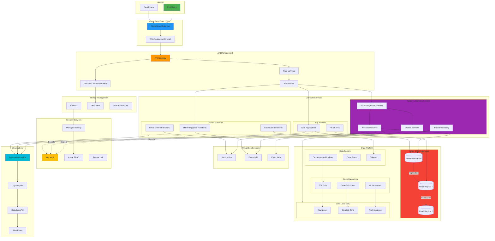
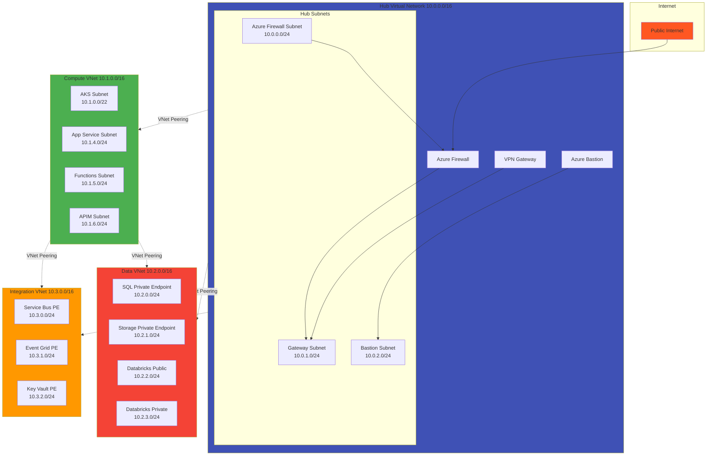
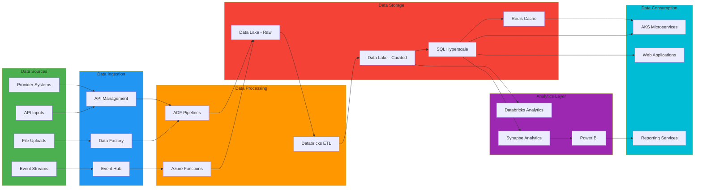
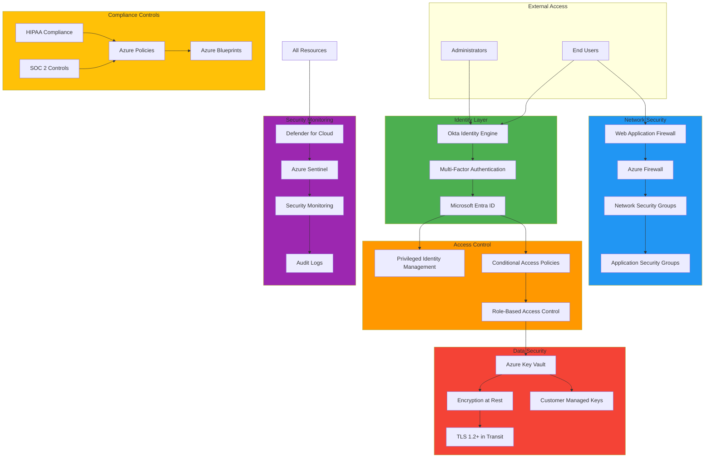
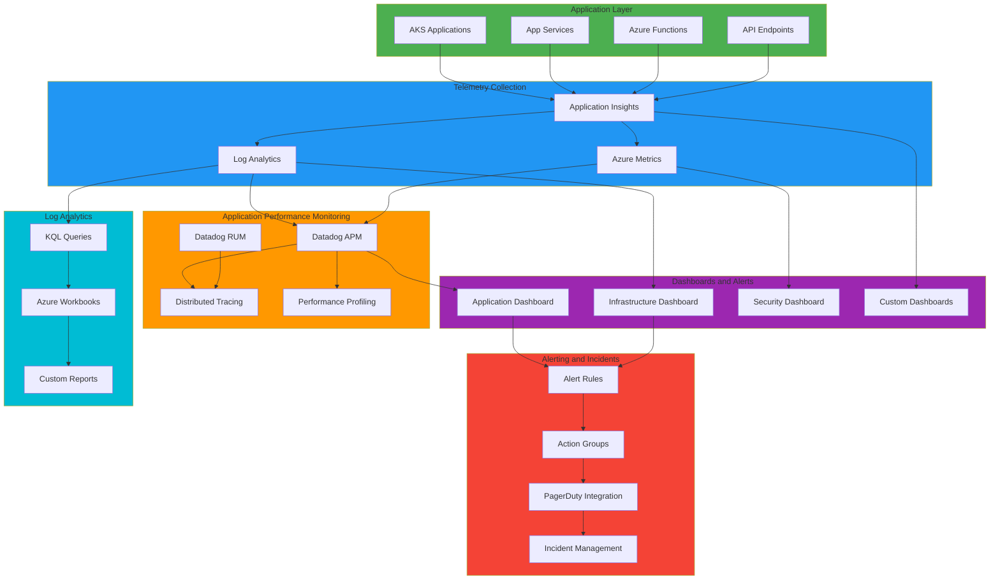

# Azure Nexus Microservices Architecture

## Complete Infrastructure Architecture

This document provides comprehensive architecture diagrams for the Azure Nexus Microservices platform deployment.

## High-Level Architecture Overview

## Network Architecture

## Data Flow Architecture

## Security Architecture

## Deployment Pipeline

```mermaid
graph LR
    subgraph Development[Development]
        Dev[Developer]
        IDE[VS Code / Visual Studio]
        Git[Git Commit]
    end
    
    subgraph Source_Control[Source Control]
        GitHub[GitHub Repository]
        PR[Pull Request]
        Review[Code Review]
    end
    
    subgraph CI_Pipeline[CI Pipeline]
        Build[Build]
        Test[Unit Tests]
        Scan[Security Scan]
        Package[Package Artifacts]
    end
    
    subgraph Infrastructure[Infrastructure as Code]
        Terraform[Terraform Plan]
        Validate[Validate]
        TFApply[Terraform Apply]
    end
    
    subgraph CD_Pipeline[CD Pipeline - Dev]
        DeployDev[Deploy to Dev]
        IntegrationTest[Integration Tests]
        SmokeTest[Smoke Tests]
    end
    
    subgraph Staging[CD Pipeline - Staging]
        DeployStaging[Deploy to Staging]
        E2ETest[E2E Tests]
        ApprovalStaging[Manual Approval]
    end
    
    subgraph Production[CD Pipeline - Production]
        DeployProd[Deploy to Production]
        HealthCheck[Health Checks]
        Monitoring[Production Monitoring]
    end
    
    Dev --> IDE
    IDE --> Git
    Git --> GitHub
    GitHub --> PR
    PR --> Review
    Review --> Build
    
    Build --> Test
    Test --> Scan
    Scan --> Package
    
    Package --> Terraform
    Terraform --> Validate
    Validate --> TFApply
    
    TFApply --> DeployDev
    DeployDev --> IntegrationTest
    IntegrationTest --> SmokeTest
    
    SmokeTest --> DeployStaging
    DeployStaging --> E2ETest
    E2ETest --> ApprovalStaging
    
    ApprovalStaging --> DeployProd
    DeployProd --> HealthCheck
    HealthCheck --> Monitoring
    
    style Development fill:#4CAF50
    style Source_Control fill:#2196F3
    style CI_Pipeline fill:#FF9800
    style Infrastructure fill:#9C27B0
    style CD_Pipeline fill:#00BCD4
    style Staging fill:#FFC107
    style Production fill:#F44336
```

## Monitoring and Observability

## Component Details

### Compute Resources
- AKS Cluster: Multi-zone, auto-scaling enabled
- App Services: Premium v3 tier with VNet integration
- Azure Functions: Premium plan with VNET integration

### Data Services
- Azure SQL Hyperscale: Multi-region replication
- Data Lake Gen2: Hierarchical namespace enabled
- Azure Databricks: Standard tier with Unity Catalog

### Security Controls
- Zero Trust network architecture
- Managed Identity for all service authentication
- Private Link for all PaaS services
- Encryption at rest with customer-managed keys
- TLS 1.2+ for all communications

### Compliance
- HIPAA compliant architecture
- SOC 2 Type II controls implemented
- Azure Policy enforcement
- Comprehensive audit logging
